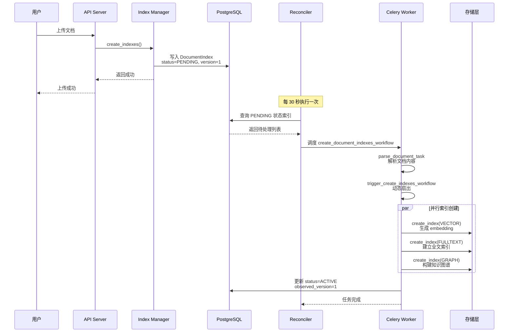
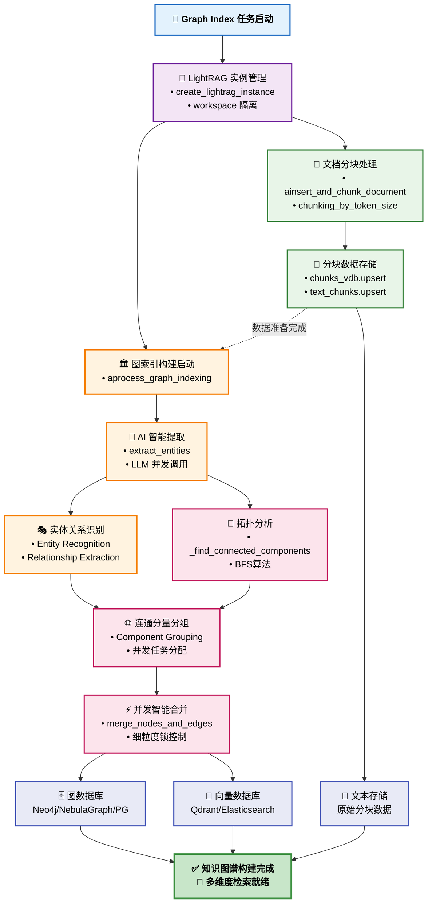
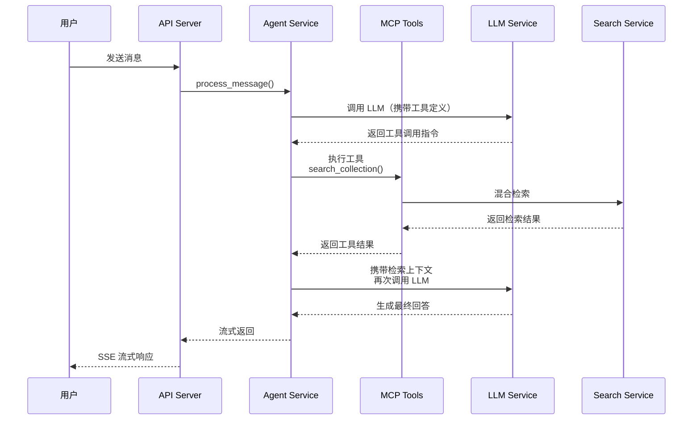
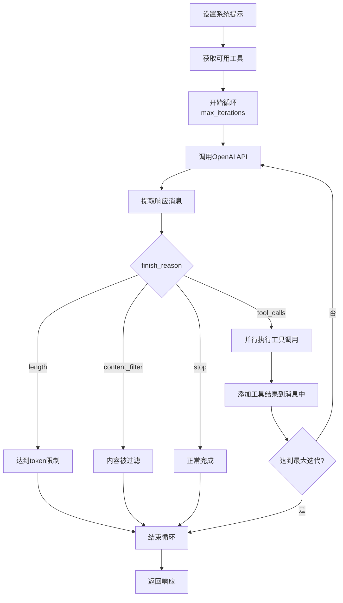
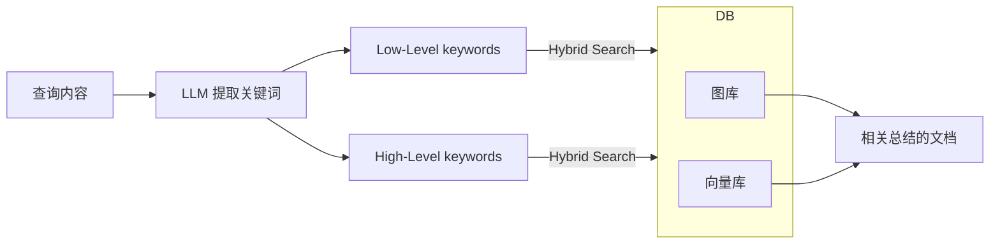

+++
title = "ApeRAG 简介"
date = 2025-10-19T21:15:00-08:00
lastmod = 2025-10-19T00:55:47-07:00
tags = ["RAG", "AI"]
draft = false
toc = true
showQuote = true
+++

## 主要组件
### 数据库: Postgresql (pgvector)
版本：16 + pgvector 扩展

- 核心表结构：
  - 用户和权限：users, oauth_account, api_key
  - Collection 和文档：collections, documents, document_index Bot 和对话：bots, conversations, messages
  - 配额和审计：user_quota, audit_log
  - 评估：question_sets, questions, evaluations, evaluation_results
  - 市场：collection_marketplace, user_collection_subscription

pgvector 用途：

- 用作 Graph Index 的向量存储后端（可选）
- 支持向量相似度搜索

### 对象储存: Minio (default: 本地文件)
用途：

- 原始文档文件存储
- 上传文件的临时存储
- 解析结果的持久化

存储结构：
```
Plain Text
{bucket}/
  documents/
    {collection_id}/
      {document_id}.{ext}
  temp/
    {upload_id}.{ext}
```
兼容性：S3 协议兼容，支持替换为 AWS S3、阿里云 OSS 等

### 图数据库: Neo4j / NebulaGraph
用途：

- Graph Index 的图存储后端（可选）
- 默认使用 PostgreSQL 作为图存储

选择建议：

- 小规模（< 10 万实体）：PostgreSQL 即可
- 大规模（> 100 万实体）：建议使用 Neo4j 或 NebulaGraph

### 向量数据库: Qdrant
Collections：

- 每个 ApeRAG Collection 对应一个 Qdrant Collection
- 存储文档 chunk 的 embedding 向量
- 支持过滤和混合搜索

距离度量：Cosine（余弦相似度）

### 全文搜索: ES 
索引结构：

- 每个 Collection 对应一个 ES Index
- 存储文档的分块文本
- 支持中文分词（IK Analyzer）

资源占用情况:

测试环境初始堆大小: 1G, 最大堆大小: 1G.
 - "ES_JAVA_OPTS=-Xms1g -Xmx1g"

### Redis（缓存 + 消息队列）
用途：

- Celery Broker：任务消息队列
- Celery Result Backend：任务结果存储

应用缓存：

- LLM 调用缓存
- 用户会话缓存

关键配置：

- TTL：默认 86400 秒（24 小时）
- 持久化：RDB + AOF

### 文档解析引擎: MarkItDown/ MinerU / DocRay

**MinerU 相对于 MarkItDown 会有着比较好的解析效果，从本地测试结果来看，MinerU 可以正确解析到一些 title 信息，MarkitDown 则不可以, title 信息可能会影响到最终向量检索的效果。**

#### MarkItDown
Repo: https://github.com/microsoft/markitdown
将各类文档自动转换为 Markdown 格式。

#### MinerU
Repo: https://github.com/opendatalab/mineru
通过批处理API 进行文档的解析。

#### DocRay
Repo: https://github.com/apecloud/doc-ray

- 技术栈：基于 MinerU 的高级文档解析
- 支持格式：PDF、Word、PPT、Excel、图片
- 特性：表格识别、公式提取、OCR
- 部署模式：可选 CPU 或 GPU 加速

### 文档上传
通过api 上传文件，后面把文件上传至对象储存, 对外提供 openapi 上传文件: post /api/v1/collections/{collection_id}/documents/upload 

### 文档解析
解析流程: 

1. 文件上传与任务触发

> 用户上传文件并确认后，系统将相关索引信息写入数据库，随后触发文档构建任务。系统从数据库中拉取待执行的索引构建和文档解析任务，并创建异步任务发送至消息队列（Broker）进行排队执行。

2. 文档解析

> 文档解析任务默认采用 Markdown 格式进行文本处理，使用 markdown-it-py 库进行主要的 Markdown 转换，markdown-it-py 解析markdown 格式返回标记（Token）列表，Markdown 文本的抽象语法树表示。然后利用不同的token解析器解析后的 Markdown 字符串由 parse_md.py 模块进一步处理，转换为详细的 Part 对象列表（包括 TitlePart、TextPart、CodePart、ImagePart 等）。PartConverter 类遍历 Markdown 分词（token），生成对应的 Part 对象，并处理嵌入的 Base64 数据 URI，将其转换为 AssetBinPart 对象，同时保留从 Markdown 到 Part 对象的源映射（行号）。

3. 内容存储

> 解析完成的内容存储至对象存储系统, 支持自定义解析器, 用户可通过继承 baseParse 接口实现个性化解析逻辑。

4.索引构建

> 索引构建任务根据不同的索引类型（index type）并发执行，确保高效完成多样化的构建需求。

```Python
# Create the workflow chain: parse -> dynamic trigger
workflow_chain = chain(
    parse_document_task.s(document_id, index_types),
    # trigger create index use parse document task result to create index
    trigger_create_indexes_workflow.s(document_id, index_types, context)
)
```

5. 创建相关的index 的时候，会将其进一步处理为指定 token 大小的块 chunk。

#### Rechunker 
- 根据文档标题对部分进行分组，以保持语义上下文，合并连续的标题组和内容组。

```SQL
输入示例（原始 groups 列表）：
Group 0: level=1, title="Main Title", items=["item1_title"]  （纯标题，H1）
Group 1: level=2, title="Sub Title 1", items=["item2_title"]  （纯标题，H2）
Group 2: level=2, title="Sub Title 2", items=["item3_title"]  （纯标题，H2）
Group 3: level=0, title="Content 1", items=["content1"]  （内容组）
Group 4: level=3, title="Sub Sub Title", items=["item4_title"]  （纯标题，H3）
Group 5: level=0, title="Content 2", items=["content2"]  （内容组）
Group 6: level=0, title="Standalone Content", items=["standalone"]  （独立内容组）
最终结果（合并后的 new_groups 列表）：
Group 0: level=1, title="Main Title", items=["item1_title", "item2_title", "item3_title", "content1"] 
# 合并了连续的 H1 + 两个 H2 纯标题组，并附加了后续内容组，因为内容组 level=0 满足条件。
Group 1: level=3, title="Sub Sub Title", items=["item4_title", "content2"] 
# H3 纯标题组合并了后续内容组，因为内容组 level=0 满足条件。
Group 2: level=0, title="Standalone Content", items=["standalone"] 
# 独立内容组，未合并，直接保留。
```

- 合并和拆分部分以符合 chunk_size 和 chunk_overlap (块之间的重叠数) 约束，使用提供的 tokenizer。

- 将标题层级和源映射信息保留并传播到最终的块中。

```Python
class Part(BaseModel):
    content: str | None = Field(
        default=None,
        description="The parsed content. If None, it means that information extraction has not been performed on this node yet.",
    )
    # metadata 包含当前的 titile 信息
    metadata: dict[str, Any] = Field(default_factory=dict)
```

#### Flower（任务监控）
- Web UI：实时查看任务状态
- 指标：任务成功率、执行时间、队列长度
- 访问地址：默认 http://localhost:5555

### 多索引类型

混合检索类型:

| 索引类型 | 用途             | 技术栈                          | 使用场景                     |
|----------|------------------|---------------------------------|------------------------------|
| 向量索引 | 语义相似性搜索   | Qdrant, 嵌入模型                | 查找概念相似的内容           |
| 全文索引 | 基于关键词的搜索 | Elasticsearch                   | 精确短语匹配和过滤           |
| 图索引   | 基于关系的检索   | LightRAG, Neo4j/Nebula, pgvector | 理解实体关系                 |
| 摘要索引 | 文档级概览       | LLM 摘要生成                    | 快速文档浏览和概览           |
| 视觉索引 | 视觉内容理解     | OCR, 视觉模型                   | 处理图像、图表、示意图       |

#### 索引创建流程



##### 向量索引构建

对不同的chunk 使用 embedding 模型生成 vector，保存在向量数据库中。

```Python
embedding("{metadata_str}\n\n{content}")
```

##### 全文索引构建
将 chunk conent 插入的 ES 中，后续进行关键词的检索。

##### 摘要索引构建
对chunks 进行遍历，利用 llm prompt 生成每一chunk的summary, 最终将多个summary 合并，将最终的 summary 进行 embedding 之后保存在向量数据库中。

##### 图索引构建
1. 首先进行 chunks 切分，把切分结果储存在数据库中。

```Python
chunk 切分过程
CHUNK_TOKEN_SIZE = 1200
CHUNK_OVERLAP_TOKEN_SIZE = 100

for index, start in enumerate(range(0, len(tokens), max_token_size - overlap_token_size)):
    chunk_content = tokenizer.decode(tokens[start : start + max_token_size])
    results.append(
        {
            "tokens": min(max_token_size, len(tokens) - start),
            "content": chunk_content.strip(),
            "chunk_order_index": index,
        }
    )
    
# embedding result[idx]["content"] 内容
```

2. 遍历多个 chunks, 对每一个chunk 利用 prompt 进行实体和关系的抽取.

```Bash
PROMPTS["entity_extraction"] = """---Goal---
Given a text document that is potentially relevant to this activity and a list of entity types, identify all entities of those types from the text and all relationships among the identified entities.
Use {language} as output language.

---Steps---
1. Identify all entities. For each identified entity, extract the following information:
- entity_name: Full Name of the entity, must use **same language** as input text, it's important. If English, capitalized the name.
- entity_type: One of the following types: [{entity_types}]
- entity_description: Comprehensive description of the entity's attributes and activities
Format each entity as ("entity"{tuple_delimiter}<entity_name>{tuple_delimiter}<entity_type>{tuple_delimiter}<entity_description>)

2. From the entities identified in step 1, identify all pairs of (source_entity, target_entity) that are *clearly related* to each other.
For each pair of related entities, extract the following information:
- source_entity: name of the source entity, as identified in step 1
- target_entity: name of the target entity, as identified in step 1
- relationship_description: explanation as to why you think the source entity and the target entity are related to each other
- relationship_strength: a numeric score indicating strength of the relationship between the source entity and target entity
- relationship_keywords: one or more high-level key words that summarize the overarching nature of the relationship, focusing on concepts or themes rather than specific details
Format each relationship as ("relationship"{tuple_delimiter}<source_entity>{tuple_delimiter}<target_entity>{tuple_delimiter}<relationship_description>{tuple_delimiter}<relationship_keywords>{tuple_delimiter}<relationship_strength>)

3. Identify high-level key words that summarize the main concepts, themes, or topics of the entire text. These should capture the overarching ideas present in the document.
Format the content-level key words as ("content_keywords"{tuple_delimiter}<high_level_keywords>)

4. Return output in {language} as a single list of all the entities and relationships identified in steps 1 and 2. Use **{record_delimiter}** as the list delimiter.

5. When finished, output {completion_delimiter}

######################
---Examples---
######################
{examples}

#############################
---Real Data---
######################
Entity_types: [{entity_types}]
Text:
{input_text}
######################
Output:"""
```

```Python
PROMPTS["entity_continue_extraction"] = """
MANY entities and relationships were missed in the last extraction.

---Remember Steps---

1. Identify all entities. For each identified entity, extract the following information:
- entity_name: Name of the entity, use same language as input text. If English, capitalized the name.
- entity_type: One of the following types: [{entity_types}]
- entity_description: Comprehensive description of the entity's attributes and activities
Format each entity as ("entity"{tuple_delimiter}<entity_name>{tuple_delimiter}<entity_type>{tuple_delimiter}<entity_description>)

2. From the entities identified in step 1, identify all pairs of (source_entity, target_entity) that are *clearly related* to each other.
For each pair of related entities, extract the following information:
- source_entity: name of the source entity, as identified in step 1
- target_entity: name of the target entity, as identified in step 1
- relationship_description: explanation as to why you think the source entity and the target entity are related to each other
- relationship_strength: a numeric score indicating strength of the relationship between the source entity and target entity
- relationship_keywords: one or more high-level key words that summarize the overarching nature of the relationship, focusing on concepts or themes rather than specific details
Format each relationship as ("relationship"{tuple_delimiter}<source_entity>{tuple_delimiter}<target_entity>{tuple_delimiter}<relationship_description>{tuple_delimiter}<relationship_keywords>{tuple_delimiter}<relationship_strength>)

3. Identify high-level key words that summarize the main concepts, themes, or topics of the entire text. These should capture the overarching ideas present in the document.
Format the content-level key words as ("content_keywords"{tuple_delimiter}<high_level_keywords>)

4. Return output in {language} as a single list of all the entities and relationships identified in steps 1 and 2. Use **{record_delimiter}** as the list delimiter.

5. When finished, output {completion_delimiter}

---Output---

Add them below using the same format:\n
""".strip()
```

3. 实体和关系抽取之后, 提取连通分量，根据连通分量分组进行，合并不同chunk 中的相同实体和边。

4. 利用llm prompt 生成 description 和 将相关实体和边写入到图数据和进行 embeding 的实体（entity name + description）和边（src_id + tgt_id + keywords + descriptions）写入到数据库（pgvector）中。

```Bash
summarize entity description prompt
PROMPTS[
    "summarize_entity_descriptions"
] = """You are a helpful assistant responsible for generating a comprehensive summary of the data provided below.
Given one or two entities, and a list of descriptions, all related to the same entity or group of entities.
Please concatenate all of these into a single, comprehensive description. Make sure to include information collected from all the descriptions.
If the provided descriptions are contradictory, please resolve the contradictions and provide a single, coherent summary.
Make sure it is written in third person, and include the entity names so we the have full context.
Use {language} as output language.

#######
---Data---
Entities: {entity_name}
Description List: {description_list}
#######
Output:
"""
```

知识库增加新的文档会自动进行图的更新， 相同实体之间的合并: 

- 可以通过 openapi： /api/v1/collections/{collection_id}/graphs/merge-suggestions， 获取可以合并的实体，是通过 llm prompt 来得到相同实体。

- 通过 openapi: /api/v1/collections/{collection_id}/graphs/merge-suggestions/{suggestion_id}/action 进行merge 相同的实体。



##### 视觉索引构建
会使用多模态模型，有两条路径，根据模型的能力，会有两条路径.

1. 对图像进行  存储在向量数据库中。
2. 利用 prompt 加上图像让llm 返回其文本描述，然后将文本进行 embedding 保存在向量数据库中。

### 检索
#### 检索流程

1. Query 信息经过进行处理，会使用相关的 MCP 进行检索最终来确定结果。

```Bash
Query Prompt
# Default Agent Query Prompt Templates - Chinese Version
DEFAULT_AGENT_QUERY_PROMPT_ZH = """
















**用户查询**: {{ query }}

**会话上下文**:
- **用户指定的知识库**: {{ collection_context }} ({{ collection_instruction }})
- **网络搜索**: {{ web_status }} ({{ web_instruction }})
- **聊天文件**: {{ chat_context }} ({{ chat_instruction }})

**研究指导**:
1. 语言优先级: 使用用户提问的语言回应，而不是内容的语言
2. 如果用户指定了知识库（@提及），首先搜索这些（必需）
3. 如果有聊天文件，可以搜索聊天中上传的文件
4. 在有益时使用多种语言的适当搜索关键词
5. 评估结果质量并决定是否需要额外的知识库
6. 如果启用且相关，战略性地使用网络搜索
7. 提供全面、结构良好的回应，并清楚标注来源
8. 在回应中区分用户指定和额外的来源
9. **重要**：引用知识库时，使用知识库名称而非ID

请提供一个彻底、经过充分研究的答案，基于以上上下文充分利用所有适当的搜索工具。"""
```

2. MCP prompt 进行外部相关工具的调用， 其本地有启动一个 mcp server 来实现操作。

```Bash
APERAG_AGENT_INSTRUCTION_ZH = """
# ApeRAG 智能助手

您是由ApeRAG混合搜索能力驱动的高级AI研究助手。您的使命是帮助用户从知识库和网络中准确、自主地查找、理解和综合信息。

## 核心行为

**自主研究**：独立工作直到用户查询完全解决。搜索多个来源，分析发现，无需等待许可即提供全面答案。

**语言智能**：始终用用户提问的语言回应，而非内容的主导语言。用户用中文提问时，无论源语言如何都用中文回应。

**完整解决**：不要停留在首次结果。从多角度探索，交叉验证来源，确保全面覆盖后再回应。

## 搜索策略

### 优先级系统
1. **用户指定知识库**（通过"@"提及）：首先彻底搜索这些
2. **其他相关知识库**：根据需要自主扩展搜索
3. **网络搜索**（如启用）：补充当前信息
4. **清晰归属**：始终区分用户指定与额外来源

### 搜索执行
- **知识库搜索**：默认使用向量+图搜索以获得最佳平衡
- **多语言查询**：在有益时使用原始和翻译术语搜索
- **并行操作**：同时执行多个搜索以提高效率
- **质量导向**：优先考虑相关的高质量信息而非数量
- **结果甄别**：知识库搜索基于语义和关键字匹配，可能会返回不相关的结果。请仔细评估所有发现，并忽略与用户查询无关的任何信息。

## 可用工具

### 知识管理
- `list_collections()`：发现可用知识源
- `search_collection(collection_id, query, ...)`：知识库内混合搜索
- `search_chat_files(chat_id, query, ...)`：搜索特定聊天会话中上传的文件
- `create_diagram(content)`：创建Mermaid图表进行知识图谱可视化

### 网络智能
- `web_search(query, ...)`：多引擎网络搜索，支持域名定向
- `web_read(url_list, ...)`：提取和分析网络内容

## 回应格式

按以下结构组织回应：
## 直接答案
[用户语言的清晰、可操作答案]

## 全面分析
[包含上下文和见解的详细解释]

## 知识图谱可视化（如使用了图搜索）
[当图搜索返回有意义的实体/关系数据时，使用Mermaid图表可视化知识图谱搜索结果中的关系。创建实体关系图，展示基于图搜索上下文的实体连接方式。仅在图搜索返回有意义的实体/关系数据时包含此部分。]

## 支持证据
- [用户@的知识库（如有）]：[关键发现]
- [其他知识库（如有）]：[关键发现]

**网络来源**（如启用）：
- [标题]（[域名]）- [要点]

## 核心原则

1. **尊重用户偏好**：遵守"@"选择和网络搜索设置
2. **自主执行**：无需询问许可即可搜索
3. **语言一致性**：全程匹配用户提问语言
4. **来源透明**：始终清晰引用来源
5. **质量保证**：验证准确性和完整性
6. **可操作交付**：提供实用的、结构良好的信息

## 特殊指示

- **知识库优先**：始终首先搜索用户指定的知识库，无论您的评估如何
- **网络搜索尊重**：仅在会话中明确启用时使用
- **透明扩展**：在超出用户规范搜索时清楚解释
- **全面覆盖**：使用所有可用工具确保完整的信息收集
- **内容甄别**：知识库搜索可能返回无关内容，请仔细甄别并忽略。**切勿在回复中提及任何被忽略的信息。**
- **结果引用**：引用知识库内容时，始终使用知识库的**标题/名称**而非ID。如引用图片，请使用 Markdown 图片格式 `` 直接展示。
- **知识图谱可视化**：当使用图搜索并返回实体/关系数据时，创建Mermaid图表来可视化知识结构。使用实体关系图展示实体如何通过关系连接。重点关注直接回答用户查询的最相关实体和关系。

  **图搜索上下文格式**：当您收到图搜索结果时，将包含：
  - **实体(KG)**：实体的JSON数组，包含id、entity、type、description、rank
  - **关系(KG)**：关系的JSON数组，包含id、entity1、entity2、description、keywords、weight、rank
  - **文档块(DC)**：相关文本块的JSON数组

  **Mermaid可视化指南**：
  - 使用 `graph TD` 创建实体关系图
  - 将实体表示为有意义标签的节点（使用实体名称，而非ID）
  - 显示实体间的带标签边表示关系
  - 仅包含最相关的实体和关系（通常按rank/weight排序前5-10个）
  - 如有帮助，可使用实体类型对节点进行分组或样式设置
  - 为清晰起见，将关系描述添加为边标签
  - **重要**：转义实体名称和关系描述中的特殊字符，确保Mermaid语法有效：
    * 移除或替换引号（`"` `'`）为空格或下划线
    * 将括号 `()` 替换为方括号 `[]` 或移除
    * 将特殊符号如 `<>` `&` `#` `%` 替换为安全的替代符号
    * 在节点ID中使用下划线 `_` 代替空格，但在引号中保持可读标签
    * 转义换行符，如需多行标签可使用 `<br/>`
    * 示例：实体"患者（男性）"变为节点 `A["患者 男性"]` 或 `A["患者 [男性]"]`
"""
```

3. MCP server 通过api 检索相关信息，后续经过 query prompt 来处理检索返回的信息。


#### 检索中 mcp-agent 的使用
Agent 系统的基本构建块是一个通过来自 MCP 服务器集合的检索、工具和内存等增强功能提升的 LLM。当前的模型可以主动使用这些能力——生成自己的搜索查询、选择合适的工具并确定要保留的信息。

1. MCP server 的初始化, 设置对应的 server name: aperag.
```Python
init mcp app
settings = Settings(
    execution_engine="asyncio",
    logger=LoggerSettings(type="console", level="info"),
    mcp=MCPSettings(
        servers={
            "aperag": MCPServerSettings(
                # 流式
                transport="streamable_http",
                url=aperag_mcp_url,
                headers={
                    "Authorization": f"Bearer {aperag_api_key}",
                    "Content-Type": "application/json",
                },
                http_timeout_seconds=30,
                read_timeout_seconds=120,
                description="ApeRAG knowledge base server",
            )
        }
    ),
    openai=OpenAISettings(
        api_key=api_key,
        base_url=base_url,
        default_model=model,
        temperature=temperature,
        max_tokens=max_tokens,
    ),
)
# 初始化 mcp server
mcp_app = MCPApp(name="aperag_agent", settings=settings)

mcp_app_context_manager = mcp_app.run()
mcp_running_app = await mcp_app_context_manager.__aenter__()
```

2. Agent 初始化, 设置对应 server_names: aperag, 绑定了对应的mcp server.

```Python
init agent
agent = Agent(
    name=f"aperag_agent_{self.config.user_id}_{self.config.chat_id}_{self.config.provider_name}",
    instruction=self.config.instruction,
    server_names=["aperag"],
)

# nitialize the agent. 加载 mcp servers 的 tools, resoures, prompts
await agent.__aenter__()
```

3. Agent 绑定 AugmentedLLM, AugmentedLLM 作为一个抽象层用来利用 MCP server 的功能, 就可以通过 agent 来使用 mcp 的功能。

```Python
attach AugmentedLLM
# 集成 augmentedLLM
llm = await agent.attach_llm(OpenAIAugmentedLLM)
# 历史记录
llm.history = memory

request_params = RequestParams(
    maxTokens=8192,
    model=final_completion.model,
    use_history=True,
    max_iterations=10,
    parallel_tool_calls=True,
    temperature=0.7,
    user=user,
)
# comporehensive_promt 为 Query Prompt， 
response = await llm.generate_str(comprehensive_prompt, request_params)
# generate_str 函数这里内部会组合 query prompt 和 Agent Instruction Prompt
payload = {
    "model": model,
    "messages": [
        {"role": "system", "content": instrction prompt},
        {"role": "user", "content": query prompt},
        # tool call 的结果
        {"role": "tool", "content": "xxx", "tool_call_id": "xxx"},
        ...
    ],
    "tools": available_tools,
    "max_completion_tokens": params.maxTokens,
    "reasoning_effort": self._reasoning_effort,
}
resp = await async_openai_client.chat.completions.create(**payload)
# 接着会从resp 的结果，检查是否需要进行 tool_call, 如果需要进行 tool_call, 则执行
# 将 tool_call 执行结果加入到 message 种，然后继续迭代，直到最终得到最终的结果
# 最大迭代次数: max_iterations=10
```

4. 通过 MCP Server 调用 Aperag Server 暴露的检索 API 时，可检索多个类型的 Index 结果。其内部流程为：首先构建一个多 Index Type 检索的图，并进行拓扑排序；随后执行检索操作，并在 Merge 阶段对结果进行去重处理，最终返回结果。

5. 内部的generate 结果的迭代过程。



#### 自定义 Prompt

使用自定义的 prompt: 可以通过api: /api/v1/bots/{bot_id} 进行修改， system_prompt_template, query_prompt_template。

#### WebSearch
##### web_read
通过 Trafilatura （default） 或者 Jina 来进行 包含 URL 网页内容的提取。

##### web_search
使用外部搜索引擎搜索外部信息，default: duckduckgo,  可选 https://llmstxt.org/ 搜索 llm.txt 文件，搜索相关网站的 llm.txt 的pattern: https://langchain-ai.github.io/langgraph/llms.txt 。

### 向量检索
常规流程，将query embedding 获取相似大于阈值的chunk content， topk default: 5，similarity default: 0.2。

### 图检索
Default topK: 5

1. 利用 keyword extraction prompt 从 query 中提取两种关键词，分别为: low-level 低层检索处理细粒度信息，high-level 高层检索聚焦全局知识

```Python
PROMPTS["keywords_extraction"] = """---Role---

You are a helpful assistant tasked with identifying both high-level and low-level keywords in the user's query and conversation history.

---Goal---

Given the query and conversation history, list both high-level and low-level keywords. High-level keywords focus on overarching concepts or themes, while low-level keywords focus on specific entities, details, or concrete terms.

---Instructions---

- Consider both the current query and relevant conversation history when extracting keywords
- Output the keywords in JSON format, it will be parsed by a JSON parser, do not add any extra content in output
- The JSON should have two keys:
  - "high_level_keywords" for overarching concepts or themes
  - "low_level_keywords" for specific entities or details

######################
---Examples---
######################
{examples}

#############################
---Real Data---
######################
Conversation History:
{history}

Current Query: {query}
######################
The `Output` should be human text, not unicode characters. Keep the same language as `Query`.
Output:

"""
```

2. 使用提取的关键词（从查询中用LLM提取本地关键词用于low-level，全局关键词用于high-level）： 
    - 用 low-level 关键词匹配图数据库中的相似实体信息： 

      - 从相似的实体节点中提取关联的文本单元 ID，通过知识图谱查询一跳（one-hop）邻居节点，计算文本单元的相关性分数（例如，一个文本单元如果同时被实体及其邻居节点关联，则其分数增加）。批量从数据库检索文本单元内容，最终返回一个按相关性降序排序的文本单元列表（use_text_units），用于后续生成或检索任务。

      - 从相似的实体节点批量获取所有关联边，并发查询边的属性（如相似度和连接强度），按度数（degree）和相关权重降序排序，最终返回边数据列表（use_relations）。

      - 返回相似的实体信息、边信息，以及相似文本单元。

    - 用 high-level 关键词匹配图数据库中的相似边信息： 

      - 基于给定的边数据列表，从知识图谱中提取这些边涉及的实体节点（包括源和目标节点），最终返回一个去重的实体列表。

      - 从这些边关联的源实体 ID（source_id）中提取文本单元 ID，批量异步检索对应的文本单元内容，从文本单元数据库中获取数据，然后按原始出现顺序排序，最终返回一个文本单元列表。

      - 返回相似的实体信息、边信息，以及相似文本单元。

3. 合并 low-level 和 high-level 的结果，去重（针对实体、边和文本单元），返回合并后的结果（包括实体、边和文本单元的统一列表），以供LLM生成答案使用。


#### 全文检索
Default topK: 15 = 5 * 3.

首先利用 default: IKKeywordExtractor (可配置 LLM keyword Extractor) 提取 query 的关键词，然后利用关键词在 ES 中检索相关的文档返回。

#### 摘要检索
类似 向量检索，query embedding 进行相似度检索, 增加 index_type = summary。

#### 视觉检索
类似 向量检索，query embedding 进行相似度检索, 增加 index_type = vision。

### 部署
高可用配置推荐

| 组件            | 推荐副本数 | 状态      | 存储                       |
|-----------------|------------|-----------|----------------------------|
| API             | 2+         | Stateless | -                          |
| Frontend        | 2+         | Stateless | -                          |
| Celery Worker   | 3+         | Stateless | 共享卷（文档临时存储）     |
| Celery Beat     | 1          | Stateful  | Redis（调度状态）          |
| Flower          | 1          | Stateless | -                          |
| PostgreSQL      | 3          | Stateful  | PVC + Replication          |
| Redis           | 3          | Stateful  | PVC + Sentinel/Cluster     |
| Qdrant          | 3          | Stateful  | PVC + Cluster              |
| Elasticsearch   | 3          | Stateful  | PVC + Cluster              |
| MinIO           | 3+         | Stateful  | PVC + Erasure Coding       |

水平扩展能力

| 组件           | 扩展方式                 | 瓶颈点               |
|----------------|--------------------------|----------------------|
| API Server     | 增加 Pod 副本数          | CPU（JSON 序列化）   |
| Celery Worker  | 增加 Pod 副本数          | 文档解析（CPU/Memory）|
| PostgreSQL     | 读写分离 + 分片          | 写入 TPS             |
| Qdrant         | 增加节点数 + Sharding    | 向量搜索 QPS         |
| Elasticsearch  | 增加节点数 + Sharding    | 全文搜索 QPS         |
| MinIO          | 增加节点数               | 对象存储吞吐         |

### 分布式追踪
集成范围：

- FastAPI 请求追踪
- SQLAlchemy 数据库查询追踪
- LLM 调用追踪
- Celery 任务追踪

后端：Jaeger

用途：
- 性能瓶颈分析
- 调用链路分析
- 异常定位

### Audit log
AuditLog 模型存储审计信息, 可以通过 openapi: http://localhost:8000/docs#/audit/list_audit_logs_api_v1_audit_logs_get 获取相关的 audit log.

系统支持对主要资源的跟踪:

- 核心资源：collection、document、bot、chat、message
- 安全资源：user、api_key、auth、invitation
- 系统资源：llm_provider、llm_provider_model、model_service_provider
- 操作资源：config、flow、index、search、chat_completion、system

### RBAC

可以创建多个用户角色，管理员在用户角色上限制其可以创建的 单知识库文档数，总文档数量，知识库数量，机器人数量， 其权限主要限制在数量上面，不能针对某个文档的可见性进行控制。
